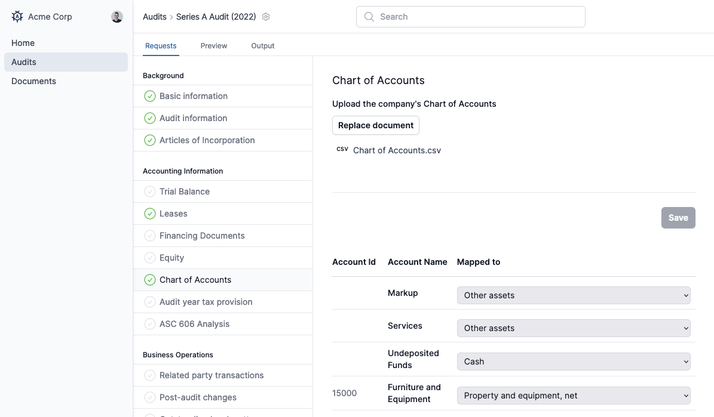
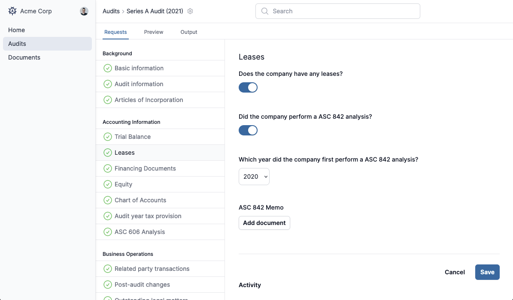
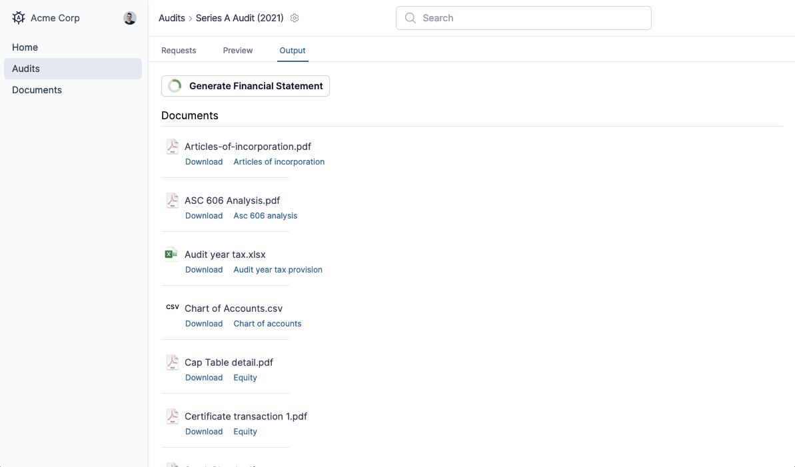
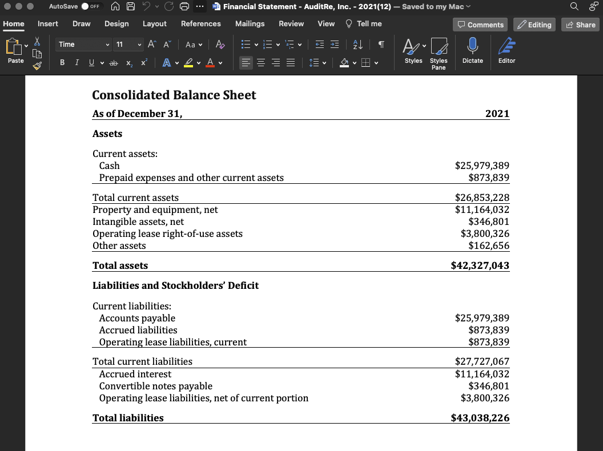

# core

Product monorepo.

- `app/`: Next.js web app
- `email-templates/`: MJML sources for transactional emails (built into `app/`).
- `ops-app/`, `ops-marketing/`, `ops-certificate/`: AWS CDK stacks.

## Overview

<p>
  
  
</p>
<p>
  
  
</p>

## Prerequisites

- Node.js 20.x (see `app/package.json` -> `volta.node`)
- Postgres (for `app/`)
- Optional: `direnv` (the app includes an `.envrc` that loads `.env` and `.env.local`)

## Bootstrap (Local App)

1. Install dependencies:

```bash
cd app
npm ci
```

2. Configure environment:

```bash
cd app
cp -n .env.local.example .env.local
```

Edit `app/.env.local` and set at least:

- `DB_HOSTNAME` (usually `localhost`)
- `DB_DATABASE` (default: `auditre`)
- `DB_USER`
- `DB_PASSWORD`
- `AUTH_SECRET` (generate one; e.g. `openssl rand -hex 32`)

3. Create/reset the database and run migrations:

```bash
cd app
npm run reset
```

4. Run the dev server:

```bash
cd app
npm run dev
```

Open `https://localhost:3000`.

Notes:

- `app/bin/db-reset.js` will create the database if it does not exist, then drops all tables/schemas/extensions and re-runs SQL migrations from `app/migrations/`.
- Creating the database requires that `DB_USER` can create databases; if it cannot, create `DB_DATABASE` manually first.
- `npm run dev` uses `next dev --experimental-https`; your browser will likely warn about a self-signed cert the first time.

## Common Commands

```bash
cd app
npm run lint
npm run test
npm run ts
```

## Email Templates

Edit MJML in `email-templates/`, then build to copy compiled HTML into the app:

```bash
cd email-templates
npm ci
npm run build
```

## Infrastructure (CDK)

Each `ops-*` folder is its own CDK TypeScript project.

```bash
cd ops-app
npm ci
npm run build
cdk synth
```
